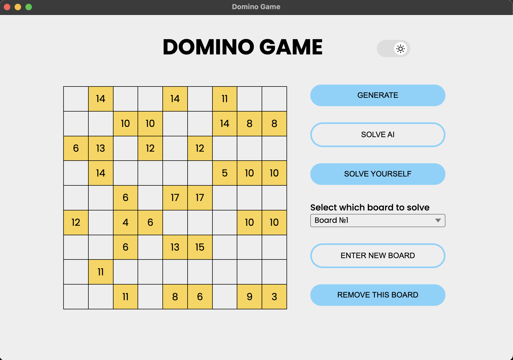
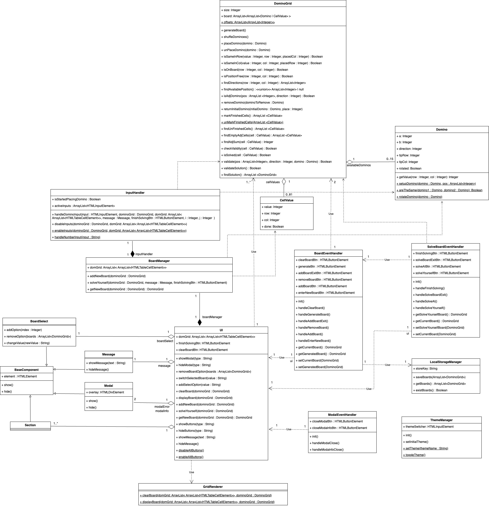
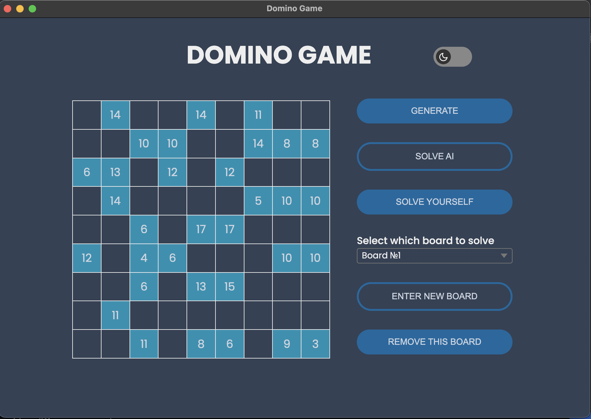

# Domino Game

### A desktop game built with [Electron](https://www.electronjs.org/)



## Main rules

Here are main game rules:

- dominoes cannot touch each other even with angles
- domino numbers cannot repeat in rows and columns
- numbers that are set in a grid of size 9 by 9 represent a sum of adjacent domino numbers
- a number cannot be placed in a cell with a domino

## Class Diagram



## Functionality

The programs allows you to:

- solve a board programmatically
- solve a board yourself
- generate a random board with an existing solution
- enter a board that you wish
- the list of all boards is saved
- you can remove a board or choose another one

## View

This game has a dark theme as well:


## Build Setup

```
# install dependencies
npm install

# start locally in a browser
npm start

# start as in dev mode in electron
npm run electron

# build an app
npm run build

# test an app
npm run test
npx run test:watch

# package
npm run package-win
npm run package-mac
```
